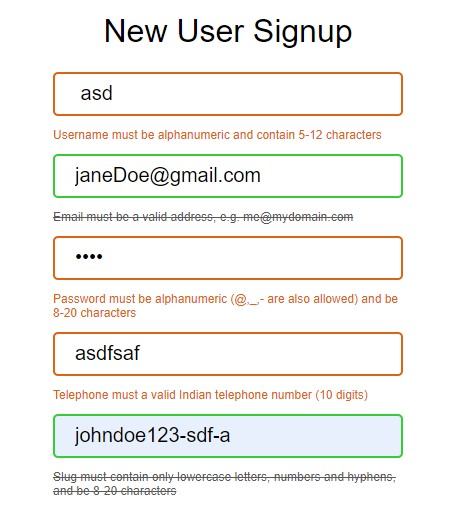

# Form Validation using Regular Expressions




## Regular Expressions

```javascript
const regExpressions = {
  username: /^\w{5,12}$/, // 5-12 char alphanumeric

  email: /^[\w\.]+@[a-z-]+\.[a-z]{2,8}(\.[a-z]{2,8})?$/i, // me@mydomain.com

  password: /^[\w@-]{8,20}$/, // 8-20 char alphanumeric with @ -

  telephone: /^\d{10}$/, // 10 digit number

  slug: /^[a-z\d-]{8,20}$/, // 8-20 char lowercase numbers -
}
```
